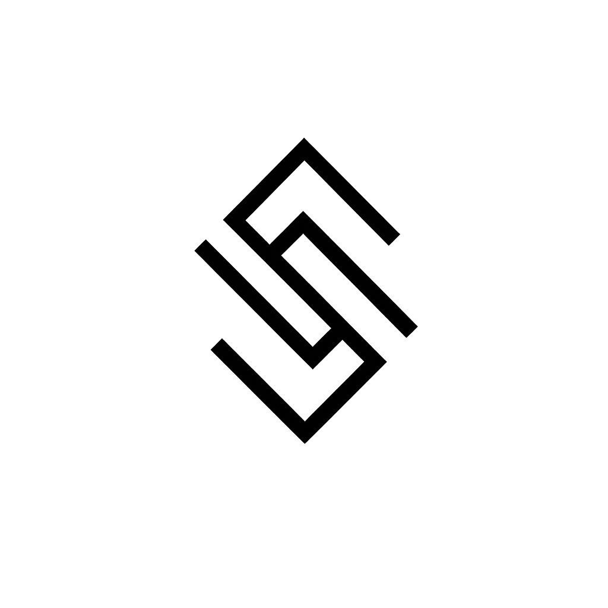

# Scoutica — Master Redesign Brief per Google Stitch

> **Cos'è questo documento.** Un brief completo, pronto da incollare in [stitch.withgoogle.com](https://stitch.withgoogle.com/), per ridisegnare da zero **tutto** Scoutica: layout, palette, font, UX, componenti e ogni singola schermata (incluse pagine di errore, stati vuoti, verifica identità, ecc.). Le istruzioni rivolte a Stitch sono **in inglese** (Stitch lavora meglio in inglese), mentre la microcopy dell'interfaccia resta **in italiano** (il prodotto è italiano-first, bilingue IT/EN).

---

## Come funziona Stitch e come usare questo brief

**Cos'è Stitch (in breve).** Strumento di design UI di Google Labs (con modelli selezionabili). Trasforma **prompt in linguaggio naturale** e **immagini/wireframe** in UI ad alta fedeltà + codice front-end. Permette di: generare schermate da una descrizione, caricare immagini di riferimento per guidare il mood, generare **varianti**, iterare via chat ("rendi l'header più piccolo", "cambia palette"), e **incollare in Figma** o esportare codice.

**Modello da usare → Stitch `3.1 Pro` (NON Flash).** Seleziona sempre **3.1 Pro**, il modello di qualità più alta, anche per le schermate ripetitive. Qui la **coerenza** tra schermate conta più del risparmio di generazioni: Flash tende a derivare su palette/font da una schermata all'altra.

**Strategia consigliata:**
1. **Incolla prima la PARTE 1 + PARTE 2** (master brief + mandato creativo). Lascia che Stitch proponga **il design system** (palette, type, griglia, motion) generando per primo lo schermo `A1 — Design System & UI Kit`. Questo "blocca" il tema.
2. Da lì in poi, per ogni schermata scrivi: *"Using the exact same design system, fonts, palette and components, design the following screen: …"* e incolla il blocco della PARTE 4.
3. Genera **una schermata alla volta** con `3.1 Pro`, partendo dalle schermate-chiave (A1 design system → H1 profilo pubblico → B1 landing → home dei 4 ruoli) e poi tutte le altre.
4. **Carica 2–3 immagini di riferimento** all'inizio (vedi PARTE 2 → Moodboard) per orientare il gusto.
5. **Dopo OGNI schermata completata, fai uno screenshot** e confrontalo con il design system bloccato: palette, font, spaziatura, navigazione e componenti devono essere **identici**. Correggi subito ogni deriva prima di passare alla schermata successiva.
6. Itera con micro-comandi in chat, poi **Paste to Figma** per assemblare il tutto.

**Una nota sulla libertà creativa.** Come richiesto, Stitch ha **mandato pieno** su colori, font e stile: deve proporre **lui** la strategia migliore. In questo brief NON imponiamo la palette o i font attuali. Diamo solo: (a) l'**anima** del brand, (b) **vincoli funzionali** non estetici (bilingue, light+dark, fotografia-first, 4 ruoli, fiducia/sicurezza, accessibilità, responsive). Il sistema attuale è citato una sola volta come contesto facoltativo, da poter **ignorare completamente**.

---

# PARTE 1 — MASTER PROMPT (incollalo per primo)

```text
You are designing a complete, world-class product redesign for SCOUTICA — an Italian fashion-talent marketplace and SaaS web app. I want an awwwards-worthy, editorial, premium result. You have FULL creative freedom over palette, typography, layout system, motion and overall art direction: propose the strongest strategy yourself. Do not feel bound by any existing styling.

WHAT SCOUTICA IS
A two-sided marketplace + SaaS that connects Italian fashion faces with the people who hire them, plus the spaces they shoot in. Four user roles, each with its own dashboard:
- MODEL (talent): builds a verified portfolio, gets discovered, applies to castings/jobs. Free forever.
- SCOUT / AGENCY / BRAND (demand side): searches talent, builds shortlists ("boards"), posts castings & jobs, contacts models. Paid plans.
- STUDIO (photo studios / locations): lists shootable spaces, receives bookings and inquiries. Paid plan.
- ADMIN: platform operations — moderation, verifications, reports, subscriptions.

CORE VALUES THAT MUST BE FELT IN THE DESIGN
- "Made in Italy", editorial, fashion-magazine sophistication (think a contemporary print magazine meets a precise software tool).
- TRUST & SAFETY first: human identity verification, 18+ only, anti-abuse. Verification badges matter.
- PHOTOGRAPHY IS THE PRODUCT: portfolios, faces and spaces are the hero content. The UI must frame imagery like a gallery, never compete with it.
- Premium but human, calm, confident, uncluttered. Less chrome, more content.

HARD FUNCTIONAL CONSTRAINTS (non-aesthetic — always respect)
1. Bilingual IT/EN. Primary language is ITALIAN — all sample copy in Italian (I provide real microcopy per screen). Keep room for longer Italian strings.
2. Full LIGHT and DARK themes, both first-class (not an afterthought).
3. Fully responsive: design desktop AND mobile for key screens. App uses a left sidebar on desktop and a bottom tab bar on mobile for dashboards.
4. Accessible: WCAG AA contrast, visible focus states, large tap targets, legible type.
5. A reusable design system: consistent buttons, inputs, cards, badges, tabs, modals, empty states, skeletons/loading, toasts.
6. Strong empty states and error states everywhere (this matters to me — include them).

DELIVERABLE STYLE
High-fidelity screens with real Italian content, real photography placeholders (editorial fashion portraits & studio interiors), and a coherent component system shared across every screen. Avoid generic dashboard-template look. Aim for a distinctive, memorable art direction.

AESTHETIC LEANING (a soft preference, not a constraint): the owner likes a very MODERN, crisp look with a pure-white background in light mode and a true-black (or near-black) background in dark mode, playing with subtle tonal shades for surfaces and depth. Treat this as the default starting point — but if you judge another palette to be stronger for an Italian-luxury fashion brand, you are free to propose it. Whatever you choose, commit and keep it perfectly consistent.

I will now ask you to (1) propose the design system, then (2) design each screen one at a time, all sharing that system. Acknowledge and start with the DESIGN SYSTEM when I send it.
```

> *(Contesto facoltativo — puoi dirlo a Stitch solo se vuoi che parta da una base, altrimenti ometti.)* Il sistema attuale si chiama "Galleria": serif editoriale (Fraunces) + grotesque (Inter Tight), inchiostro su crema caldo, zero border-radius, bordi hairline 1px, look da rivista. **Stitch è libero di tenerlo, evolverlo o sostituirlo del tutto.**

---

# PARTE 2 — MANDATO CREATIVO (la "rivoluzione")

Incolla questo subito dopo la Parte 1, oppure usalo come secondo messaggio.

```text
ART DIRECTION MANDATE — surprise me, but stay coherent.

Emotional target: walking into a Milan gallery opening — quiet luxury, confidence, human warmth, zero noise. The reader should feel "this is where serious Italian fashion talent lives."

Explore (your choice, pick ONE strong direction and commit):
- A distinctive type system: pair an expressive display face with a precise text face. Big, art-directed headlines. Consider a magazine masthead feel.
- A confident color strategy that flatters photography. PREFERRED DIRECTION (soft default, not a hard rule): a very modern, minimal, high-contrast monochrome system — pure white (#FFFFFF) background in light mode, true/near black in dark mode — using subtle neutral shades for surfaces, hairlines and depth, with at most one restrained accent. If you believe a warm-neutral editorial or a different palette would serve an Italian-luxury fashion brand better, you are free to choose it instead. It MUST work flawlessly in both light and dark.
- A clear grid and layout rhythm (editorial columns, generous whitespace, intentional asymmetry).
- Tasteful motion: reveals, image parallax, hover micro-interactions. Subtle, never gimmicky.
- The LOGO is FIXED — do not invent one. Scoutica already has an official brand mark (an angular, interlocking geometric monogram — a stylized "S" on a 45° diagonal, rhombus silhouette, thin uniform strokes, Greek-key feel, fully monochrome). Reproduce it faithfully (see the "BRAND ASSET — LOGO" section below + the uploaded reference image). You MAY still choose the TYPOGRAPHY of the "Scoutica" wordmark that locks up beside it. The mark is used for favicon, collapsed sidebar, avatars and badges.

AVOID: generic SaaS gradients, bubbly rounded cards everywhere, stocky illustrations, neon, cluttered dashboards, drop-shadow soup. Avoid anything that looks like a default UI kit.

PRINCIPLES: content over chrome; photography framed like a gallery; hairlines and type doing the work instead of heavy boxes; one confident accent rather than many colors.

Give imagery direction too: where full-bleed editorial photos go, where portrait grids go, where the UI stays quiet to let faces speak.
```

**Moodboard da caricare in Stitch (immagini di riferimento):**
- **Il logo ufficiale** `public/images/logo-finale-dark.png` (il mark da riprodurre fedelmente — vedi sotto).
- La cover attuale `public/images/hero-cover.webp` (per il soggetto/mood fotografico).
- 1 screenshot di un sito awwwards di moda/editoriale che ti piace (per il gusto).
- 1 interno di studio fotografico (per la parte Studio).

---

## LOGO DI SCOUTICA — asset di brand FISSO (non ridisegnare)

Il logo **non** rientra nella libertà creativa: è già definito e va mantenuto. È un **monogramma geometrico** — una «S» stilizzata, angolare e intrecciata, ruotata di 45° con silhouette a **rombo**; tratti sottili a spessore uniforme, soli angoli a 90°/45° (sapore «greca»/labirinto), nessuna curva, **monocromatico** (inchiostro pieno su sfondo chiaro, bianco su sfondo scuro). Stitch resta libero **solo** sulla tipografia del wordmark «Scoutica» che gli sta accanto.



**Asset già pronti nel repo** (`public/images/`):
- `logo-finale-dark.png` — mark **nero**, per sfondi chiari (taglie `-32 / -64 / -128 / -256 / -512`).
- `logo-finale.png` — mark **bianco**, per sfondi scuri (stesse taglie `-32 … -512`).
- Uso: favicon, sidebar collassata, avatar placeholder, badge. Lockup = mark + wordmark «Scoutica» (gap ~10px, allineati al centro ottico); solo-mark dove lo spazio è stretto.

> Da incollare in Stitch (in inglese):
```text
BRAND LOGO IS FIXED — do not invent a new one. Scoutica's mark is an angular, interlocking geometric monogram: a stylized "S" rotated 45° with a tall rhombus (diamond) silhouette, built only from thin, uniform-width straight strokes meeting at 90°/45° angles (Greek-key / labyrinth feel), no curves, no fills, fully monochrome. Reproduce it faithfully as a crisp inline SVG that inherits currentColor: solid ink (the theme's primary text color) on light surfaces, pure white on dark surfaces — it MUST invert cleanly with the theme. I am uploading the official mark as a reference image; match its proportions and stroke exactly. Use it for: favicon, collapsed sidebar, avatar placeholder, brand/"Verificato" badges, and as a lockup (mark + "Scoutica" wordmark) in the marketing navbar, footer and auth pages. You may choose ONLY the wordmark typography that pairs with the mark.
```

---

# PARTE 3 — ARCHITETTURA & RAGIONAMENTO (cosa mostrare, dove, perché)

Questa è la parte "ragioniamo insieme": le mie raccomandazioni di information architecture, da passare a Stitch come guida (è già richiamata nei prompt della Parte 4).

## Mappa del prodotto (sitemap)
- **Pubblico / Marketing:** Landing · Chi siamo · Prezzi · Studi (directory) · Studio (dettaglio) · Profilo modello pubblico (`/profile/[slug]`, condivisibile, ottimizzato OG/social).
- **Auth:** Login · Registrazione (scelta ruolo) · Registrazione Modello/Scout/Studio · Password dimenticata · Verifica email · Verifica selfie (identità, pubblica via token).
- **Dashboard Modello:** Home · Profilo (editor) · Portfolio · Discover · Casting (+dettaglio) · Lavori (+dettaglio) · Candidature · Contatti · Messaggi (+thread) · Notifiche · Impostazioni · Abbonamento.
- **Dashboard Scout/Agenzia/Brand:** Home · Profilo · Verifica · Discover (ricerca talenti) · Casting (+nuovo, +candidature) · Lavori (+nuovo, +candidature) · Boards (+dettaglio) · Contatti · Messaggi · Notifiche · Impostazioni · Abbonamento.
- **Dashboard Studio:** Home (NUOVA — vedi sotto) · Studi (lista, +nuovo, +editor) · Prenotazioni · Richieste · Messaggi · Notifiche · Impostazioni.
- **Admin:** Dashboard · Utenti · Verifiche scout · Verifiche modelle (selfie) · Casting (moderazione) · Segnalazioni · Abbonamenti · Impostazioni.
- **Sistema:** 404 · 500 · stati vuoti · skeleton/loading.

## Landing — ordine consigliato delle sezioni
1. **Hero cover immersiva full-bleed.** Foto editoriale a tutta pagina, masthead da rivista ("N° 01 · GIUGNO 2026"), headline display, sottotitolo, **doppia CTA** ("Sono un modello" / "Sono uno scout o un'agenzia"). La foto fa da background, testo e bottoni sopra, scrim scuro per leggibilità. *(È la direzione già scelta: mantienila ed elevala.)*
2. **Striscia di fiducia / numeri.** Modelli pubblicati · Scout verificati · 20 regioni · Studi partner. Social proof presto, subito sotto la piega.
3. **Cast — talenti in evidenza.** Griglia/marquee editoriale di card modello reali (le foto sono il prodotto). Per i non loggati: teaser "Registrati per vedere il resto".
4. **Tre vie.** 3 card grandi con foto editoriale: *Modello* (ritratto), *Scout/Agenzia/Brand* (backstage casting), *Studio* (interno spazio). Ognuna con CTA dedicata.
5. **Metodo (come funziona).** 3 step, con enfasi su **verifica identità & sicurezza** (è il differenziatore: dillo forte).
6. **Bandi — anteprima opportunità.** 3 card di casting/lavoro "live" per dimostrare che il marketplace è attivo (compenso in evidenza, città, scadenza, stato aperto/in chiusura).
7. **Teaser prezzi.** "Gratis per i talenti. Sostenibile per la filiera." Da €0.
8. **Manifesto / valori.** Editoriale, italiano, fiducia, made in Italy.
9. **Banda scura di chiusura + CTA + footer.**

## Dashboard — cosa mettere (per ruolo)
**Principio comune di ogni Home:** saluto personale + **3–4 KPI** + **azione primaria** + feed "cosa fare adesso" + attività recente. Niente muri di numeri: gerarchia chiara, un dato protagonista.

- **Modello Home:** anello "Profile Strength" (0–100%), visite settimana + trend, **feed opportunità** consigliate (casting+lavori compatibili), contatti in attesa, candidature attive. Checklist onboarding finché il profilo non è pubblicato. CTA: completa/pubblica profilo, aggiorna portfolio.
- **Scout Home:** **ricerca talenti** in primo piano (search bar grande), candidature recenti ricevute, boards/shortlist, **quota contatti** del mese (con upsell al piano Pro), casting/lavori attivi. CTA: cerca talenti, nuovo casting.
- **Studio Home (DA AGGIUNGERE):** oggi manca — Studio entra diretto nella lista. Crea una vera home: **prossime prenotazioni** (mini-calendario/lista), **richieste in arrivo** (inbox), performance degli annunci (visite), CTA: aggiungi studio / gestisci disponibilità.
- **Admin Home:** KPI di piattaforma + **code di moderazione** in evidenza (verifiche scout, verifiche modelle, segnalazioni) con badge quando >0, e ricavi (MRR, abbonamenti attivi).

## Dove vanno foto e loghi
- **Foto full-bleed:** hero landing, colonna laterale delle pagine auth, banda di chiusura.
- **Griglie di ritratti:** Cast in landing, Discover, Boards, profilo pubblico (la gallery È l'eroe).
- **Interni/spazi:** directory Studi + dettaglio Studio (cover grande + thumbnail).
- **Wordmark "Scoutica":** nav marketing, footer, top sidebar (espansa), pagine auth.
- **Monogramma "S":** favicon, sidebar collassata, avatar placeholder, badge.
- **UI silenziosa:** dashboard, form, impostazioni — qui le foto sono piccole (avatar, cover), il contenuto comanda.

## Modello di navigazione
- **Marketing:** nav fissa trasparente sopra l'hero (diventa solida allo scroll), wordmark a sinistra, link al centro (Home, Chi siamo, Prezzi, Studi), a destra Login + Registrati + switch lingua.
- **Dashboard desktop:** sidebar sinistra collassabile/pinnabile (248px ↔ 68px, espande su hover), header sticky con notifiche + lingua + tema, footer sidebar con avatar/nome/logout.
- **Dashboard mobile:** bottom tab bar (4–5 voci per ruolo), header con logo + menu.

## Sistema di componenti da standardizzare
Buttons (primary/secondary/outline/ghost/destructive + sizes), inputs/labels/validazione, select/multiselect, checkbox/toggle, **card** (talento, casting/lavoro, studio, prenotazione, stat), **badge** (ruolo, piano, stato, verificato, featured/boost), tabs/segmented, **empty state** (icona + titolo + sottotitolo + CTA), **skeleton/loading**, toast, modal/dialog, paginazione, avatar, anello di progresso, masthead/eyebrow editoriale.

---

# PARTE 4 — PROMPT SCHERMATA-PER-SCHERMATA (pronti da incollare)

> Premetti a ciascuno: *"Using the exact same design system, fonts, palette and components we established, design this screen for Scoutica (Italian-first, light + dark, responsive desktop + mobile):"* — poi incolla il blocco.

## A — Design system & componenti globali

### A1 — Design System & UI Kit *(genera per primo · 3.1 Pro)*
```text
Propose the full Scoutica design system on one canvas: color palette for LIGHT and DARK (background, surfaces, text scale, one confident accent, success/danger), full type scale (display + text faces, from oversized editorial H1 down to captions/eyebrows), spacing & grid, and a component library: buttons (primary, secondary, outline, ghost, destructive; sm/md/lg), text inputs with label + helper + error, select, multiselect chips, checkbox, toggle, radio, tabs/segmented control, badges (role, plan, status, "Verificato" with check, "In evidenza"), avatar + the FIXED Scoutica monogram (see the BRAND ASSET — LOGO section; reproduce it, don't redesign it), progress ring, card shells, modal/dialog, toast, pagination, empty-state block, and loading skeletons. Show light and dark side by side. Editorial, premium, photography-friendly, zero clutter. PREFERRED PALETTE (soft default — override if you find something stronger for Italian-luxury fashion): a very modern, minimal monochrome — pure white background in light, true/near-black in dark, subtle neutral shades for surfaces and hairlines, one restrained accent.
```

### A2 — Marketing navbar + footer
```text
Design the public marketing navigation bar and footer.
NAVBAR: transparent overlay on top of a full-bleed hero (text light), turning into a solid bar on scroll. Left: "Scoutica" wordmark. Center: links "Home", "Chi siamo", "Prezzi", "Studi". Right: "Accedi" (ghost), "Registrati" (primary), and an IT/EN language switch. Mobile: hamburger → full drawer.
FOOTER: editorial, multi-column. Columns: Prodotto (Prezzi, Studi, Funzionalità), Azienda (Chi siamo, Contatti), Legale (Privacy, Termini), Social (Instagram, LinkedIn). Big "Scoutica" wordmark, tagline "Una rivista di nuovi volti.", masthead line "Scoutica — Milano · Roma · Firenze", "© 2026 Scoutica", IT/EN switch.
```

### A3 — Dashboard shell (sidebar + header + mobile tab bar)
```text
Design the dashboard application shell, light and dark.
DESKTOP: fixed left sidebar, collapsible (wide ~248px showing icon+label, collapsed ~68px icons-only, expands on hover). Top: Scoutica wordmark (collapsed: "S" monogram) + pin/collapse button. Middle: nav items (icon + label), a PRIMARY group and, below a hairline divider, a SECONDARY group (Notifiche, Impostazioni). Active item clearly marked. Bottom: user avatar + name + email, language switch, theme toggle, logout. Sticky top header: optional page title, right side has notifications bell (with unread dot), language switch, theme toggle. Main content area with generous padding, max content width.
MOBILE: sidebar hidden; sticky header with "S" monogram + menu; fixed bottom tab bar with 5 items. Show the MODEL set as example: Dashboard, Opportunità, Candidature, Messaggi, Notifiche.
```

## B — Marketing

### B1 — Landing page *(schermata-chiave · 3.1 Pro)*
```text
Design the Scoutica marketing landing page, desktop and mobile, light + dark. Sections in this exact order:
1) HERO: full-bleed editorial fashion portrait as the background; dark scrim for legibility; magazine masthead row at top ("N° 01" left, "GIUGNO 2026" right); large display headline "Nuovi volti per la moda italiana. Selezionati con cura, presentati con metodo."; supporting line; two CTAs side by side: primary light button "Sono un modello", outline-white "Sono uno scout o un'agenzia"; a thin manifesto line at the bottom "Una rivista di nuovi volti — Milano · Roma · Firenze". Text and buttons sit ON the photo.
2) TRUST STRIP: four big numbers with labels — "Modelli pubblicati", "Scout verificati", "Regioni coperte" (20), "Studi partner".
3) CAST (featured talent): editorial heading "Cast" + an art-directed grid/marquee of real model portrait cards (face, name, city). Tasteful, gallery-like.
4) TRE VIE: section "Le tre vie" — three large cards each with an editorial photo: "Sono un modello" (portrait), "Sono uno scout o un'agenzia" (casting backstage), "Ho uno studio" (studio interior). Each: eyebrow label, title, short description, arrow link.
5) METODO: "Il metodo" — three numbered steps (01–03) emphasizing human identity verification and safety as the differentiator.
6) BANDI: "Bandi aperti" — three live opportunity cards (type badge Casting/Lavoro, title, scout · city, short description, COMPENSO highlighted, days left, status dot "Aperto"/"In chiusura").
7) PRICING TEASER: big "€0", line "Gratis per i talenti. Sostenibile per la filiera.", link "Vedi i piani".
8) MANIFESTO: editorial values block, Italian, made-in-Italy tone.
9) CLOSING: dark full-width band with a serif CTA headline, "Registrati" button, and a masthead footer line.
Use hairlines and big type instead of heavy boxes. Photography is the hero.
```

### B2 — Chi siamo (About)
```text
Design the "Chi siamo" page, editorial and text-led. Header: eyebrow "Manifesto · Chi siamo", giant serif headline "Chi siamo", lead "Una piattaforma editoriale per il fashion italiano. Talento, sguardo, luogo — un solo sistema." Then sticky-eyebrow sections with numbered labels: "01 — Manifesto" (why Scoutica exists, modernising Italian scouting), "02 — Perché adesso" ("Il fashion italiano merita la sua piattaforma."), "03 — Valori" (4-card grid: Sicurezza, Professionalità, Qualità, Italia prima di tutto), "04 — Princìpi" (numbered list of 5: Trasparenza, Verifica umana, Controllo al modello, Editorial first, Made in Italy). Centered closer: "Scoutica è progettata, sviluppata e mantenuta a Milano." Use generous whitespace, hairline dividers, big editorial type.
```

### B3 — Prezzi (Pricing)
```text
Design the pricing page. Header: eyebrow "Tariffario · 2026", display headline "Gratis per i talenti. Sostenibile per la filiera.", lead "I modelli non pagano mai. Scout, agenzie e studi scelgono il piano che serve. Nessuna percentuale sui guadagni. 14 giorni di prova gratuita." A Mensile/Annuale (-17%) toggle. Then a 4-column plan grid:
- MODELLO: "€0 / per sempre", "Per chi vuole farsi notare." features: portfolio, candidature, richieste, URL pubblico. CTA "Registrati come modello".
- SCOUT PRO (featured, "Più scelto" badge): "€29/mese" (o €290/anno). features: contatti illimitati, boards, ricerca avanzata, ricerche salvate, casting illimitati. CTA "Inizia come Scout Pro".
- AGENCY: "€99/mese" (founding badge, €149 barrato). features: tutto Pro, workspace multi-utente (3 posti), profilo agenzia pubblico, analytics, account manager. CTA "Registra agenzia".
- STUDIO: "€49/mese". features: casting illimitati, candidature avanzate, ricerca talenti, annuncio studio con gallery, statistiche. CTA "Inizia come Studio".
Below: add-ons section "Promozione e visibilità" — two cards: "Profile Boost €4,99 / 7 giorni" (profilo in evidenza nella discovery) and "Casting Promosso €49 / 14 giorni". Footnote about managed payments arriving H2 2026. Clean cards, the featured plan visually elevated, hairline grid.
```

### B4 — Studi (directory) e B5 — Studio (dettaglio)
```text
B4 STUDI DIRECTORY: Header eyebrow "Studi", display headline "Studi e location in Italia", lead description. Filter bar: search by name, region dropdown (20 Italian regions), studio type. Results count "X spazi trovati". Responsive grid of studio cards (image 4:5, name, type badge, city with pin, short description). Pagination "01 / 12" with Prev/Next. Editorial, image-forward.

B5 STUDIO DETAIL: Back link "← Studi". Large gallery: big cover + thumbnail strip. Two-column layout: LEFT — type badge, studio name (H1), location line with pin, "Gestito da {nome}", description, a specs grid (mq, tariffa/ora, capienza, parcheggio, accessibilità, servizi) with icons, amenities checklist, availability. RIGHT (sticky) — a booking request form: date range, ora, durata, nome, email, telefono, note, CTA "Richiedi prenotazione"; plus a contact card. Gallery is the hero.
```

## C — Auth

### C0 — Auth layout (condiviso)
```text
Design the shared auth layout: a two-column split. LEFT: form column on a clean surface with the "Scoutica" wordmark at top, the form centered, a small footer link. RIGHT: a full-height dark editorial photo column with a magazine masthead "N° 01 · Scoutica", a centered serif statement "Lavoro autentico. Identità verificata.", and a city list at the bottom (Milano · Roma · Firenze). On mobile the photo column collapses to a slim top banner. This frame wraps all auth screens below.
```

### C1 — Login
```text
Login screen inside the auth layout. Eyebrow "Accesso", headline "Accedi a Scoutica", subtitle "Bentornato! Accedi al tuo account." Fields: Email, Password (with right-aligned "Password dimenticata?" link). Error banner state for wrong credentials. Primary button "Accedi". Hairline divider, then a "Continua con Google" secondary button. Bottom: "Non hai un account? Registrati". Show normal and error states.
```

### C2 — Registrazione (scelta ruolo)
```text
Role picker screen. Eyebrow "Registrazione", headline "Unisciti a Scoutica", subtitle "Crea il tuo account e inizia." Section label "Come vuoi registrarti?" then three large clickable rows/cards, numbered, each with an icon and hover accent:
"01 · Sono un modello — Crea il tuo profilo professionale e fatti scoprire." (camera icon)
"02 · Sono un professionista — Scout, agenzia o brand: scopri nuovi talenti." (briefcase icon)
"03 · Ho uno studio — Affitta il tuo spazio a professionisti della moda." (building icon)
Footer: "Hai già un account? Accedi". Editorial, hairline dividers between rows.
```

### C3 — Registrazione Modello / Scout / Studio
```text
Three registration forms in the auth layout, same visual system, each with eyebrow "Registrazione · {Modello|Scout|Studio}" and headline "Unisciti a Scoutica".
MODELLO: Email, Password, Data di nascita (date picker), checkbox "Confermo di avere almeno 18 anni" (required — show the underage error state), checkbox "Accetto i Termini e la Privacy", a CAPTCHA widget, primary button "Crea account".
SCOUT: Tipo (segmented: SCOUT / AGENZIA / BRAND), Email, Password, Termini checkbox, CAPTCHA, "Crea account".
STUDIO: Nome, Cognome, Nome attività, Email, Password, Conferma password, Termini, CAPTCHA, "Crea account".
Show the 18+ validation prominently for the model form (safety is core).
```

### C4 — Password dimenticata + Verifica email
```text
TWO related screens in the auth layout.
FORGOT PASSWORD: eyebrow "Password dimenticata", headline "Hai dimenticato la password?", subtitle, Email field, button "Invia link di reset". Plus the SUCCESS state: a check icon in a bordered box, "Email inviata", body "Se un account con quell'email esiste, riceverai le istruzioni.", link "Torna al login".
VERIFY EMAIL: three states on one canvas — (1) waiting: "Controlla la tua casella e clicca il link per verificare il tuo account." with resend + change-email actions; (2) success: check icon, "Email verificata!", CTA "Continua"; (3) error: "Il link non è valido o è scaduto", "Richiedi un nuovo link".
```

### C5 — Verifica selfie (identità, opzionale)
```text
Design the live identity verification screen (optional badge, not a gate). Centered card. Title "Verifica identità", subtitle "Scatta un selfie per ottenere il badge di verifica (opzionale)." Main panel: a live camera viewport (front camera) with a face guide, a large "Scatta" capture button, then a captured-preview state with "Conferma e invia" / "Riprova". A QR fallback block for when there's no camera ("Inquadra il QR dal telefono"). Success state: "Selfie inviato. La verifica è in revisione, ti avviseremo." Privacy reassurance microcopy. Calm, trustworthy, not clinical.
```

## D — Dashboard Modello

### D1 — Model Home *(schermata-chiave · 3.1 Pro)*
```text
Model dashboard home. Header: eyebrow "01 — Sommario", serif greeting "Bentornata, {Nome}", and a contextual status line + actions (if profile incomplete: "Completa il tuo profilo per farti scoprire" with buttons "Completa profilo"/"Pubblica profilo"; if published: "Visualizza profilo" + "Modifica profilo"). If not yet published, show an ONBOARDING CHECKLIST card ("Pronto per essere scoperta?", 4 steps: dati, 3+ foto, misure, pubblica) with progress. METRICS row, eyebrow "02 — Numeri", four KPI cells on a hairline grid: Visite questa settimana (+trend %), Profile Strength (progress ring + tier "Professionale/Solido/Iniziale"), Contatti in attesa, Candidature attive. MAIN GRID: left (8 cols) "Opportunità per te" — feed of recommended casting/job cards (type badge, title, scout · city, deadline) with empty state "Nessuna opportunità al momento"; right (4 cols) "Attività recente" notification list + "Azioni rapide" (Aggiorna portfolio, Esplora opportunità). Editorial hierarchy, one hero number, not a wall of stats.
```

### D2 — Model Profilo (editor)
```text
Model profile editor. Title "Il tuo profilo", subtitle "Completa il tuo profilo per farti scoprire da scout e agenzie." A completeness card (progress ring + % + tips like "Aggiungi foto", "Completa le misure"). A profile photos manager (thumbnail grid, upload/drag-drop, set-cover, reorder). A long form in clear sections (use tabs or accordion): Dati personali (nome, bio, nascita, genere, città, regione), Misure (altezza, seno, vita, fianchi, scarpe, taglia), Aspetto (occhi, capelli, etnia), Professionale (categorie multi-select, status, lingue, disponibilità a viaggiare), Social (Instagram, TikTok, YouTube, X, sito, follower), Visibilità (toggle pubblico/privato). A publish-control card showing status (INCOMPLETO / NON PUBBLICATO / PUBBLICATO) with publish/unpublish and a requirements checklist. Inputs must handle long Italian labels.
```

### D3 — Model Portfolio
```text
Model portfolio manager. Eyebrow "01 — Portfolio", serif headline "Portfolio", lead "Gestisci le tue immagini. Massimo 12 foto. JPG, PNG, WebP — max 10MB." Then "Le tue immagini (X/12)": an editorial image grid where each item shows the photo, a cover badge if set, and hover actions (Imposta cover, Elimina, Riordina via drag handle). An upload dropzone tile when under the max. Optional plan-upgrade teaser. Treat photos like a gallery, minimal chrome.
```

### D4 — Model Discover + D5 — Model Castings/Lavori list *(pattern riusabile)*
```text
D4 DISCOVER: a browse grid of model cards (cover photo, name, city, category chips, verified badge, save/like heart on hover). Top bar: results count + a column-density selector (1–5). Empty state "Nessun profilo trovato".

D5 OPPORTUNITY LIST (reuse this pattern for Model "Casting Aperti" AND "Lavori Disponibili", and for Scout's own listings): header with title + description; a list/grid of opportunity cards — type badge (Casting/Lavoro), title, scout name + type badge, city with pin, deadline with calendar, compensation badge, an apply CTA with states (Non candidato / Candidato / Chiuso), and a save bookmark. Empty state with a megaphone icon, e.g. "Al momento non ci sono casting aperti. Torna più tardi!". Make it scannable.
```

### D6 — Casting/Job detail *(pattern riusabile)*
```text
Opportunity detail page (reuse for casting and job, model side). Header: type badge, title (H1), posted by (scout name + verified badge), status. Full description, a requirements section, a specs strip (date, compenso, posti). A sticky apply panel on the right with the primary CTA "Candidati" (and applied/closed states) + "Contatta". A "simili" rail at the bottom. Let the brief read like an editorial call sheet.
```

### D7 — Applications / Contacts *(pattern riusabile)*
```text
TWO list screens, same system.
CANDIDATURE (model): title "Le tue candidature", subtitle, segmented filter (Tutte / In attesa / Accettate / Rifiutate / Ritirate). Rows: casting/job title, status badge (orologio/check/x), scout, città, scadenza, "Ritira" if pending. Empty state "Non hai ancora candidature".
CONTATTI (model): title "Richieste di contatto", subtitle "Gestisci chi può contattarti". Cards: scout avatar+name, motivo, anteprima messaggio, status badge, Accetta/Rifiuta if pending, timestamp. Empty "Nessuna richiesta di contatto".
```

### D8 — Messaggi (messaging) *(pattern riusabile per tutti i ruoli)*
```text
Messaging screen, two-pane. LEFT: conversation list (avatar, name, last-message preview, timestamp, unread badge) + search. RIGHT: chat thread with a conversation header (avatar, name, status), scrollable bubbles (mine vs theirs), and a composer "Scrivi un messaggio…" with send. Mobile: list and thread are separate views. Empty state "Nessuna conversazione". Calm, focused, lots of breathing room.
```

### D9 — Notifiche + Impostazioni + Abbonamento *(pattern riusabile per tutti i ruoli)*
```text
THREE screens sharing the system.
NOTIFICHE: title "Notifiche", subtitle "Cronologia della tua attività", "Segna tutte come lette". A typed notification list (icon, title, description, timestamp, link). Empty state bell icon "Nessuna notifica — le tue notifiche appariranno qui."
IMPOSTAZIONI: title "Impostazioni". Sections: Profilo (nome, email, avatar), Preferenze (lingua IT/EN, tema chiaro/scuro/auto), Password, Notifiche email (toggles), and a clearly separated "Zona pericolo" with "Elimina account" (destructive + confirm modal).
ABBONAMENTO: title "Abbonamento". Current plan card (nome piano, prezzo, rinnovo, status badge). A compact plan comparison with upgrade/downgrade. For scouts on FREE: a "X di Y contatti rimasti questo mese" meter with upsell. Billing history table (data, descrizione, importo, ricevuta). Active boosts list with days remaining.
```

## E — Dashboard Scout / Agenzia / Brand

### E1 — Scout Home *(schermata-chiave · 3.1 Pro)*
```text
Scout dashboard home. Header: eyebrow "01 — Sommario", serif greeting "Bentornato, {Nome attività}", meta badges "{Scout|Agenzia|Brand} · {Piano} · {Città}", CTAs "Ricerca talenti" (primary, search icon) + "Nuovo casting" (outline). A prominent TALENT SEARCH entry (big search field or hero search card) — searching talent is the scout's #1 job. METRICS, eyebrow "02 — Numeri": primary 4-cell hairline grid (Casting attivi, Lavori attivi, In revisione [highlight if >0], Conversazioni) + secondary 2-cell grid (Shortlist/Boards, Contatti in attesa). MAIN GRID: left (8) "Candidature recenti" (model avatar, name, casting/job, status, time, view-profile/message) with empty state; right (4) "Attività recente". A 4-tile quick actions grid: Cerca talenti, Crea casting, Crea lavoro, Apri boards. If the scout is NOT yet verified, show a read-only banner at top (see E2).
```

### E2 — Scout read-only banner + Verifica
```text
Design (a) a persistent read-only banner shown to unverified scouts across the dashboard: "Account in verifica — puoi esplorare, ma alcune azioni sono bloccate finché non sei verificato." with a "Completa la verifica" button; and (b) the VERIFICA screen: title "Verifica account", subtitle "Completa la verifica per accedere a tutte le funzionalità." Form: nome, nome attività, ruolo (es. Casting Director), città, email professionale, sito, profilo social, P. IVA, upload documenti (opzionale), button "Invia richiesta di verifica". States: submitted ("La tua richiesta è in revisione."), approved (success badge). Reassuring, trust-building.
```

### E3 — Scout Discover (ricerca talenti) *(schermata-chiave · 3.1 Pro)*
```text
Scout talent search — the core demand-side screen. LEFT filter panel (collapsible on mobile): testo, regioni (multi), categorie (multi), range altezza, range età, colore occhi/capelli, lingue, status professionale, plus "Salva ricerca" and a saved-searches list. Some advanced filters are gated to paid plans (show a subtle lock + "Pro"). MAIN: results count + grid-density selector (1–6), then an editorial grid of model cards (cover, name, city, category chips, verified badge, boost/featured badge, save-to-board heart). Pagination. Empty state "Nessun modello trovato con questi filtri — Azzera i filtri". This screen should feel like flipping through a casting book.
```

### E4 — Scout Boards (shortlist) + dettaglio
```text
TWO screens.
BOARDS LIST: header + CTA "Crea bacheca" (opens a small dialog: nome + descrizione). Grid of board cards: an overlapping mini-avatar stack of the first models, board name, "12 modelli", "Aggiornata 2 giorni fa". Empty state "Non hai ancora bacheche — Crea una bacheca".
BOARD DETAIL: board name + description, actions (modifica, elimina, condividi/esporta), then a model-card grid (same as discover) with per-card "Rimuovi", "Vedi profilo", "Messaggio". Empty state "Questa bacheca è vuota". Treat it like a curated mood/casting board.
```

### E5 — Scout Casting/Lavori (lista, nuovo, candidature)
```text
THREE screens for the scout's own listings (reuse for both Casting and Lavori).
LISTA: eyebrow + serif headline "I tuoi casting" + lead, top-right "Nuovo casting" CTA. A numbered row list (01, 02…): title, status badge (Bozza/Pubblicato/Chiuso/Archiviato), "X candidature", timestamp, link to applications. Empty "Non hai ancora casting — Crea il tuo primo casting".
NUOVO: form — titolo, descrizione, città (regione auto), data casting, scadenza candidature, requisiti, compenso + toggle "Pagato", posti disponibili, note, upload foto. Buttons "Salva bozza" + "Pubblica". (Job version adds: tipo lavoro [Editorial/Commercial/Campaign], durata, diritti d'uso.)
CANDIDATURE: casting title + status header, back link, list of applicant cards (model avatar+name, data, status badge, Accetta/Rifiuta/Messaggio/Vedi profilo), optional bulk select. Empty "Nessuna candidatura ancora".
```

> Scout **Profilo, Contatti, Messaggi, Notifiche, Impostazioni, Abbonamento**: riusa i pattern D7/D8/D9 e E2, con copy lato scout (es. Contatti = "Richieste di contatto inviate", "Modelli che hai contattato").

## F — Dashboard Studio

### F1 — Studio Home *(NUOVA · schermata-chiave · 3.1 Pro)*
```text
Create a NEW Studio dashboard home (it doesn't exist yet — studios currently land on a list). Header: eyebrow "01 — Sommario", serif greeting "Bentornato, {Studio}", CTAs "Aggiungi studio" + "Gestisci disponibilità". METRICS: Prenotazioni in arrivo, Richieste da gestire (highlight if >0), Visite agli annunci (settimana), Studi attivi. MAIN GRID: left (8) "Prossime prenotazioni" as a mini calendar or date-grouped list (progetto, studio, date range, ora, stato) with empty state "Nessuna prenotazione in arrivo"; right (4) "Richieste recenti" inbox preview + "Attività recente". Make a studio owner feel in control of their calendar.
```

### F2 — Studio: Studi (lista, nuovo, editor)
```text
THREE screens.
STUDI LIST: eyebrow "Studi", serif headline "I miei studi", lead, top-right "Aggiungi studio". Card grid (image 4:5 with Building fallback, nome, type badge, città/regione, status badge Attivo/Inattivo, "X prenotazioni", "Aggiornato…"). Empty state Building icon "Non hai ancora studi — Crea il tuo primo studio per ricevere prenotazioni".
NUOVO (multi-step or accordion): 1) Base — nome, tipo (Studio fotografico/Location/Sala), descrizione, indirizzo, città, regione, CAP; 2) Dettagli — mq, tariffa oraria, servizi (checkbox: WiFi, Parcheggio, A/C, Cucina…), capienza, accessibilità; 3) Foto — gallery upload, set cover, riordina; 4) Disponibilità — fasce orarie settimanali, chiusure. "Salva bozza" + "Pubblica".
EDITOR: same populated + editable, status badge, gallery editor, availability, plus quick "Prenotazioni recenti" and "Richieste recenti" sections linking to the full pages.
```

### F3 — Studio: Prenotazioni + Richieste
```text
TWO inbox-style screens.
PRENOTAZIONI: title "Prenotazioni", subtitle "Visualizza e gestisci le prenotazioni dei tuoi studi". Booking cards: progetto (H3), "per {Studio}", status badge (In attesa/Confermata/Annullata/Completata), actions menu (conferma, annulla, completa), date range with calendar icons, time range, prezzo, contatti (email/telefono). Empty state Inbox icon "Nessuna prenotazione — le richieste appariranno qui."
RICHIESTE (inquiries): title "Richieste di informazioni", subtitle "Gestisci le richieste dei clienti". Inquiry cards: nome/progetto, "per {Studio}", status (In attesa/Risposto), message preview, contatti, date preferite, durata, timestamp, actions (Rispondi, Archivia). Empty "Nessuna richiesta".
```

> Studio **Messaggi, Notifiche, Impostazioni**: riusa D8/D9 con copy studio.

## G — Admin

### G1 — Admin Dashboard
```text
Admin overview. Title "Admin", subtitle "Piattaforma — Panoramica". A stat-card grid (responsive 2/3/4 cols): Utenti totali (clickable), Modelli, Scout/Agenzie, Verifiche in attesa (highlight if >0, clickable), Segnalazioni in attesa (highlight if >0, clickable), Casting attivi, Abbonamenti attivi (with MRR €/mese). Dense, calm, operational — the highlighted moderation queues should pull the eye.
```

### G2 — Admin: Verifiche scout + Verifiche modelle
```text
TWO moderation queues.
VERIFICHE SCOUT: title + "X richieste in attesa". Cards: nome+avatar, tipo (Scout/Agenzia/Brand), status badge, an info grid (nome attività, email, sito link, P.IVA, città, inviato il), optional admin notes, and actions Approva (primary) / Rifiuta (with reason modal). Empty "Nessuna verifica in attesa".
VERIFICHE MODELLE: title + "X selfie in attesa". Cards: the submitted selfie thumbnail, nome (link to public profile), status "Inviato", email, inviato il, "4 foto" portfolio count, actions Approva/Rifiuta (with optional notes). Note that after a decision the selfie is deleted for privacy. Empty "Nessuna verifica modella in attesa".
```

### G3 — Admin: Utenti, Casting (moderazione), Segnalazioni, Abbonamenti, Impostazioni
```text
FIVE admin screens, same dense system.
UTENTI: "Gestione utenti", "Ultimi 100 utenti". Dense rows: avatar, nome/email, role badge (Modello/Scout/Studio/Admin), plan badge if paid, suspended badge if applicable, "Iscritto 3 settimane fa", actions menu (sospendi, vedi profilo, messaggio).
CASTING (moderazione): "Casting (Moderazione)". Rows: titolo, scout (link), status badge, data, "X candidature", flag se segnalato, actions (revisiona, segnala, archivia, elimina).
SEGNALAZIONI: "Segnalazioni", "Violazioni segnalate". Cards: utente segnalato, tipo contenuto, motivo (Molestie/Profilo falso/Contenuto inappropriato/Spam), status, dettagli, actions (Risolvi, Ignora, Sospendi utente, Vedi contenuto).
ABBONAMENTI: "Abbonamenti", metrics (abbonamenti attivi, MRR, breakdown per piano), subscription rows (utente, piano, status, prezzo, rinnovo, actions).
IMPOSTAZIONI: "Impostazioni amministrative" — feature toggles, template email, rate limit, chiavi Stripe (mascherate), zona pericolo.
```

## H — Profilo modello pubblico

### H1 — Public Model Profile *(schermata vetrina · 3.1 Pro)*
```text
Design the public, shareable model profile (the product's showcase page, optimized for sharing). Back link. A large gallery hero: full-width cover photo + a thumbnail strip / lightbox for the rest of the portfolio. Two-column layout. LEFT (2/3): badges row (a "Verificata" check badge if approved, a "In evidenza" badge if boosted), name (H1), location with pin, age ("20 anni"), professional-status badge; an "About"/bio section; a "Misure" grid (altezza, seno, vita, fianchi, scarpe, taglia, occhi, capelli, etnia) with small icons; a "Professionale" section (lingue, disponibilità a viaggiare, categorie chips, status); a social row (Instagram, TikTok, YouTube, X, sito) with follower count. RIGHT (1/3, sticky): a contact panel — for verified scouts "Richiedi contatto" (primary), for logged-out "Accedi per contattare"; a "…" menu with Segnala / Blocca; for scouts a private-note card + "Aggiungi a bacheca" selector. The photography must dominate; the data is set like an editorial spec sheet. This is the single most important screen to make stunning.
```

## I — Sistema (errori e stati)

### I1 — 404 + 500
```text
TWO system pages, matching the editorial brand.
404: a giant serif "404" (oversized, light weight), eyebrow "Errore · 404 · Not Found", headline "Pagina non trovata", body "La pagina che cerchi non esiste o è stata spostata.", buttons "Torna alla home" (primary) + "Esplora gli studi" (outline). Footer line: "S" monogram + "Scoutica · Milano".
500: same composition with a giant "500", eyebrow "Errore · 500 · Server", headline "Qualcosa è andato storto", body "Si è verificato un errore imprevisto. Riprova o torna indietro.", buttons "Riprova" (primary) + "Torna alla home" (outline). Make errors feel intentional and on-brand, not default.
```

### I2 — Empty & loading states (sistema)
```text
Design a consistent EMPTY STATE block (centered icon, serif title, one-line subtitle, single CTA) shown in three contexts as examples: no opportunities, no messages, no search results. And design LOADING SKELETONS for: a model-card grid, an opportunity list, and a dashboard home (KPIs + lists). Quiet, elegant, on-brand — no spinners-only.
```

---

# PARTE 5 — CLAUSOLE RIUSABILI (da appendere a qualsiasi prompt)

```text
[FREEDOM] You have full creative freedom on palette, type and styling — choose the strongest option; just keep it consistent with the design system we locked, and ensure AA contrast in both light and dark.

[RESPONSIVE] Provide both a desktop and a mobile version. On mobile, dashboards use a bottom tab bar; marketing uses a hamburger drawer.

[ITALIAN] All visible copy in Italian (the strings I provide). Keep layouts tolerant of longer Italian text. Keep an EN equivalent in mind (bilingual product).

[PHOTOGRAPHY] Use real editorial fashion photography placeholders (portraits for talent, interiors for studios). Frame images like a gallery; keep surrounding UI quiet.
```

---

## Checklist di copertura (così non manca nulla)

- [x] Landing (9 sezioni) · Chi siamo · Prezzi · Studi directory · Studio dettaglio
- [x] Login · Scelta ruolo · Reg. Modello/Scout/Studio · Password dimenticata · Verifica email · Verifica selfie
- [x] Nav marketing · Footer · Dashboard shell (sidebar/header/bottom-nav)
- [x] Modello: Home · Profilo · Portfolio · Discover · Casting (+dettaglio) · Lavori (+dettaglio) · Candidature · Contatti · Messaggi · Notifiche · Impostazioni · Abbonamento
- [x] Scout: Home · Banner read-only · Verifica · Discover · Boards (+dettaglio) · Casting/Lavori (lista/nuovo/candidature) · Profilo · Contatti · Messaggi · Notifiche · Impostazioni · Abbonamento
- [x] Studio: Home (nuova) · Studi (lista/nuovo/editor) · Prenotazioni · Richieste · Messaggi · Notifiche · Impostazioni
- [x] Admin: Dashboard · Utenti · Verifiche scout · Verifiche modelle · Casting moderazione · Segnalazioni · Abbonamenti · Impostazioni
- [x] Profilo pubblico modello (vetrina)
- [x] 404 · 500 · empty states · loading skeletons
- [x] Design system / UI kit · componenti · badge · stati

> **Suggerimento finale.** Genera nell'ordine: A1 (design system) → H1 (profilo pubblico) → B1 (landing) → D1/E1/F1/G1 (home dei 4 ruoli) → poi tutto il resto riusando i pattern. Genera **tutto con `3.1 Pro`**; le prime cinque sono le più importanti, falle per prime e fai uno **screenshot di verifica** dopo ognuna.
